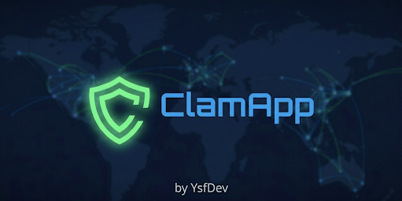

<p align="center">
  
</p>


<h1 align="center">ClamApp</h1>
<p align="center">
  <strong>A professional, open-source ClamAV GUI for Linux</strong><br>
  Real-time threat detection · Secure quarantine · Network monitoring · Security toolkit
</p>

<p align="center">
  <a href="https://github.com/YsfDev1/ClamApp/releases"></a>
  <a href="LICENSE"></a>
  
  
</p>

---

## Features

| Module | Description |
|--------|-------------|
| 🔍 **Antivirus Scanner** | Quick, full, and custom directory scans powered by [ClamAV](https://www.clamav.net/). Drag-and-drop support. |
| 🛡 **Secure Quarantine** | Moves infected files to `~/.local/share/clamapp/quarantine/`, strips all permissions (`chmod 0o000`), and writes a restoration metadata sidecar. |
| 🌐 **Network Monitor** | Process-level I/O monitoring via `psutil` in a background thread — displays live TCP/UDP connections, PIDs, and allows one-click process termination. |
| 🔒 **Security Toolkit** | Password generator, cipher tool (multi-algorithm), SHA/MD5 hash calculator, secure file shredder (multi-pass DOD-style), AES-256 encrypted vault, EXIF metadata cleaner. |
| 🧹 **System Hygiene** | Cache cleaner for common Linux temp directories. |
| 📋 **Security Audit** | Summarises system security posture. |
| 🚀 **Startup Manager** | Lists and toggles XDG Autostart (`~/.config/autostart`) and `systemd --user` services for XDG Autostart compliance. |
| 📦 **App Manager** | Installed package overview. |
| 📊 **Task Manager** | Lightweight process viewer with CPU/RAM usage. |
| 🔌 **USB Guardian** | Auto-scans removable media on plug-in via `pyudev`. |

---

## Requirements

### System
- Linux (any distribution with systemd or SysV init)
- **ClamAV** ≥ 0.103 — install with your package manager:
  ```bash
  # Debian / Ubuntu / Pardus / Linux Mint
  sudo apt install clamav clamav-daemon

  # Fedora / RHEL / CentOS
  sudo dnf install clamav clamd

  # Arch Linux / Manjaro
  sudo pacman -S clamav

  # openSUSE
  sudo zypper install clamav
  ```
- Python **3.10+**

### Python dependencies
```
PyQt6 >= 6.4.0
psutil >= 5.9.0
cryptography >= 41.0.0
Pillow >= 10.0.0
pyudev >= 0.24.0
```

---

## Installation

### Option A — pip (recommended)
```bash
git clone https://github.com/YsfDev1/ClamApp.git
cd ClamApp
pip install .
clamapp          # launch the app
```

### Option B — virtual environment (development)
```bash
git clone https://github.com/YsfDev1/ClamApp.git
cd ClamApp
python -m venv .venv
source .venv/bin/activate
pip install -r requirements.txt
python main.py
```

### Option C — system-wide (advanced)
```bash
# Install dependencies from your distro's repos where possible
sudo apt install python3-pyqt6 python3-psutil python3-cryptography python3-pil python3-pyudev
pip install --user .
clamapp
```

---

## First Run — Initialize Local Storage

ClamApp stores scan history, settings, and quarantined files in your home directory (never in the repo):

```bash
python scripts/init_local_storage.py
```

This creates (with secure permissions):
```
~/.local/share/clamapp/
├── quarantine/        # chmod 700 — quarantined malware
└── app_data.json      # chmod 600 — scan history & settings
```

> **Note:** If `$XDG_DATA_HOME` is set, ClamApp respects it automatically.

---

## Updating Virus Definitions

ClamAV ships without a live database. You **must** update it before your first scan:

```bash
# Method 1: freshclam (standard, recommended)
sudo freshclam

# Method 2: via the app
# Settings → Update Database (runs freshclam with pkexec, no terminal needed)
```

> On distributions using systemd, the `clamav-freshclam.service` handles automatic updates.
> ClamApp's in-app updater stops the service, updates, and restarts it automatically.

---

## Desktop Integration

To add ClamApp to your application menu (GNOME, KDE, XFCE, and any XDG-compliant DE):

```bash
# Install system-wide
sudo desktop-file-install clamapp.desktop
sudo update-desktop-database

# Or install for current user only
cp clamapp.desktop ~/.local/share/applications/
update-desktop-database ~/.local/share/applications/
```

Right-clicking the app in the taskbar shows **Quick Scan** and **Full Scan** jump-list actions.

---

## Running Tests

```bash
# Install test dependencies
pip install pytest

# Run all tests (no ClamAV or root required — everything is mocked)
python -m pytest tests/ -v
```

Expected output:
```
tests/test_scanner.py          ...........   PASSED
tests/test_security_tools.py   .........    PASSED
tests/test_network_monitor.py  ........     PASSED
```

---

## Project Structure

```
ClamApp/
├── main.py                    # Repo-mode entry point
├── pyproject.toml             # Build metadata & pip entry point
├── setup.py                   # Legacy pip shim
├── requirements.txt           # Pinned runtime deps
├── clamapp.desktop            # Linux desktop entry (GNOME/KDE/XFCE)
├── scripts/
│   └── init_local_storage.py  # XDG-aware first-run initializer
├── src/
│   ├── version.py             # Semantic versioning + update checker
│   ├── backend/
│   │   ├── clam_wrapper.py    # ClamAV subprocess wrapper
│   │   ├── data_manager.py    # Persistence + secure quarantine
│   │   ├── data_shredder.py   # Multi-pass DOD file shredder
│   │   ├── crypto_vault.py    # AES-256 file encryption
│   │   └── privacy_shield.py  # EXIF metadata scrubber
│   ├── gui/
│   │   ├── main_window.py     # Main app window & navigation
│   │   ├── scanner_thread.py  # QThread: clamscan (live progress)
│   │   ├── network_monitor_thread.py  # QThread: psutil polling
│   │   ├── network_view.py    # Active connections tab
│   │   └── ...                # Other view modules
│   └── modules/               # Standalone feature modules
├── assets/
│   └── icons/
└── tests/
    ├── test_scanner.py         # ClamWrapper unit tests (mocked)
    ├── test_network_monitor.py # NetworkMonitorThread tests (mocked)
    └── test_security_tools.py # Shredder, vault, quarantine tests
```

---

## Contributing

1. Fork the repository
2. Create a feature branch: `git checkout -b feature/my-feature`
3. Run tests to ensure nothing is broken: `python -m pytest tests/ -v`
4. Submit a pull request

Please do **not** commit `app_data.json` or anything inside `quarantine/` — both are in `.gitignore` for good reason.

---

## License

**GPL-3.0-or-later** — see [LICENSE](LICENSE) for full text.

ClamAV® is a registered trademark of Cisco Systems, Inc. This project is not affiliated with or endorsed by Cisco.
=======

A modern and user friendly security app that Integrated with ClamAV engine.

# 🛡️ ClamApp: Advanced Security Suite for Linux

**ClamApp** is an open-source, modern security management interface built on top of the trusted **ClamAV** engine. Designed with a focus on simplicity and modern aesthetics, it brings robust malware protection to Linux desktop users through an intuitive graphical experience.

**Built on:** Pardus 25


---

## ✨ Key Features

* **Intelligent Scanning:** Rapidly detect and neutralize threats with an optimized multi-threaded scanning engine.
* **Secure Quarantine:** Safely isolate suspicious files in a restricted environment to prevent system-wide infections.
* **Real-time Feedback:** Live progress monitoring and detailed threat reporting.
* **Modern UI/UX:** A sleek, responsive dark-themed interface built with **PyQt6**, following modern cybersecurity design principles.
* **System Integration:** Lightweight architecture designed to run efficiently on **Pardus**, Debian, and Ubuntu-based distributions.
* **other**: Users can examine the virus code safely. Built for enthusiasts too. network tracking, startup apps, app manager, task manager, and other utilities...

---

## 🛠️ Built With

* **Language:** Python 
* **UI Framework:** PyQt6 (Qt for Python)
* **Core Engine:** ClamAV 

---

## 🚀 Future Roadmap

ClamApp is evolving from a standalone scanner into a comprehensive security toolkit. Upcoming modules include:

 **More security tools**
 **Bug fixes**
 

---

## 📥 Getting Started

To run ClamApp on your local machine, ensure you have ClamAV installed and follow these steps:

```bash
# Clone the repository
git clone [https://github.com/YsfDev1/ClamApp.git](https://github.com/YsfDev1/ClamApp.git)

# Navigate to the project directory
cd ClamApp

# Install required dependencies
pip install -r requirements.txt

# Launch the application
python3 main.py
>>>>>>> 73509aa6811d1fca4ec74cabe02169f57473617b
